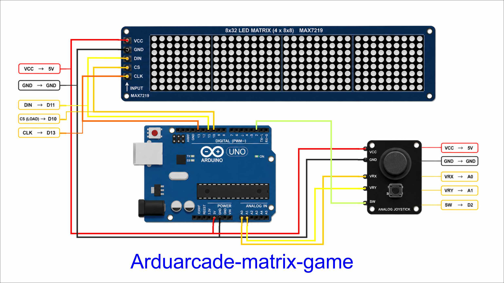

# ArduArcade Matrix Game

Varios juegos arcade retro en una sola base de hardware: Arduino Uno, joystick analogico y matriz MAX7219. El proyecto esta pensado para educacion, talleres y makers que quieran aprender logica de juego, entradas analogicas y electronica sencilla sin cambiar de circuito cada vez.

## Que es

La idea es simple: un mismo montaje fisico, varios juegos cargables.

- una base comun con Arduino Uno
- joystick analogico con pulsador
- matriz LED MAX7219 encadenada
- sketches intercambiables para probar juegos distintos

Esto permite usar el proyecto como banco de pruebas, actividad educativa o mini arcade retro de sobremesa.

## Para quien es

- educacion tecnica y aprendizaje practico
- makers que quieran reutilizar el mismo circuito
- talleres de electronica creativa
- personas que quieran empezar con juegos simples en microcontroladores

## Juegos incluidos

| Juego | Archivo | Descripcion |
| --- | --- | --- |
| Pong | [src/main.cpp](/home/javier/Tetris_LCD/src/main.cpp) | Version activa. Pensada para 4 displays de 8x8, con marcador y sets. |
| Dodger | [src/main.cpp.dodger](/home/javier/Tetris_LCD/src/main.cpp.dodger) | Esquiva obstaculos, con dash, vidas y aumento de dificultad. |
| Shooter | [src/main.cpp.shooter](/home/javier/Tetris_LCD/src/main.cpp.shooter) | Nave lateral con disparos, enemigos y marcador dedicado. |
| Snake | [src/main.cpp.snake](/home/javier/Tetris_LCD/src/main.cpp.snake) | Variante de Snake para matriz LED. |
| Test | [src/main.cpp.test](/home/javier/Tetris_LCD/src/main.cpp.test) | Verificacion de joystick, orientacion y matriz antes de jugar. |

## Hardware base

- Arduino Uno
- 4 u 8 modulos MAX7219 de 8x8, segun el juego cargado
- joystick analogico con pulsador
- cables Dupont
- fuente de 5V estable para la matriz LED

## Conexion rapida

### Matriz MAX7219

| Modulo | Arduino Uno |
| --- | --- |
| VCC | 5V |
| GND | GND |
| DIN | D11 |
| CS / LOAD | D10 |
| CLK | D13 |

### Joystick

| Joystick | Arduino Uno |
| --- | --- |
| VCC | 5V |
| GND | GND |
| VRX | A0 |
| VRY | A1 |
| SW | D2 |

## Notas de montaje

- Usa siempre masa comun entre Arduino, joystick y matriz.
- Conecta el primer modulo MAX7219 por el lado `IN`.
- Si usas varios modulos, alimenta la matriz con una fuente de 5V estable.
- Si la imagen sale rara, revisa orientacion, orden fisico de los modulos y tipo de hardware.

## Configuracion del proyecto

- placa objetivo: `Arduino Uno`
- entorno: `PlatformIO`
- libreria principal: `MD_MAX72XX`
- tipo de hardware configurado: `FC16_HW`

## Compilar y subir

### Con PlatformIO (Linux / Mac / Windows)

```bash
pio run
pio run -t upload --upload-port /dev/ttyACM0
```

En Windows, sustituye `/dev/ttyACM0` por el puerto COM que aparezca en el Administrador de dispositivos al conectar el Arduino (por ejemplo `COM3`).

### Con Arduino IDE (Windows, Mac o Linux)

Arduino IDE es la opcion mas sencilla si no tienes PlatformIO instalado.

1. Abre el sketch que quieras cargar desde la carpeta `src/`. Por ejemplo `main.cpp` para el Pong activo.
2. Copia todo el contenido y pegalo en un sketch nuevo del IDE, o abre el archivo directamente.
3. Elimina la primera linea del archivo:
   ```cpp
   #include <Arduino.h>
   ```
   Arduino IDE la agrega por su cuenta; si la dejas duplicada dara error de compilacion.
4. Instala la libreria `MD_MAX72XX` desde el gestor de librerias del IDE: `Herramientas > Administrar bibliotecas > busca MD_MAX72XX > instala la de MajicDesigns`.
5. Selecciona la placa: `Herramientas > Placa > Arduino Uno`.
6. Selecciona el puerto: `Herramientas > Puerto > el COM que aparezca al conectar el Arduino`.
7. Pulsa `Subir` (flecha hacia la derecha). El IDE compilara y grabara el sketch en la placa.

El resto del codigo queda exactamente igual; solo es necesario quitar esa primera linea.

## Cambiar de juego

El sketch activo es siempre [src/main.cpp](/home/javier/Tetris_LCD/src/main.cpp).

Para activar otro juego desde terminal:

```bash
cp src/main.cpp.shooter src/main.cpp
pio run -t upload --upload-port /dev/ttyACM0
```

Puedes sustituir `main.cpp.shooter` por `main.cpp.dodger`, `main.cpp.pong40`, `main.cpp.snake` o `main.cpp.test`.

## Flujo recomendado

1. Empieza con [src/main.cpp.test](/home/javier/Tetris_LCD/src/main.cpp.test) para comprobar joystick y orientacion.
2. Cuando el hardware responda bien, carga el juego que quieras.
3. Ajusta cantidad de modulos y constantes del sketch si cambias de matriz.

## Circuito



## Video

Aqui ira el video del proyecto en funcionamiento.

## Galeria

Aqui iran imagenes del circuito, la matriz y los distintos juegos cargados.

## Objetivo

- reutilizar un solo circuito para varios juegos arcade retro
- aprender programacion y electronica de forma visual y practica
- ofrecer una base sencilla para educacion y makers
- mantener una estetica retro con hardware economico y accesible
